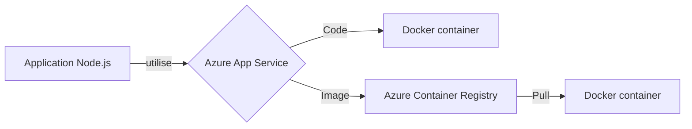
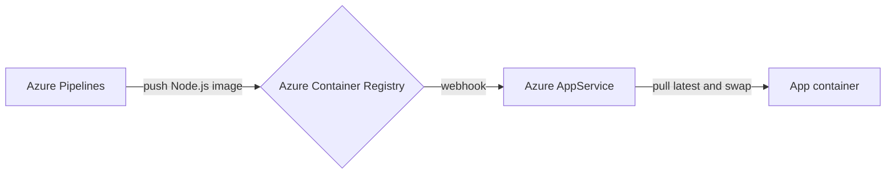

---
# try also 'default' to start simple
theme: seriph
# random image from a curated Unsplash collection by Anthony
# like them? see https://unsplash.com/collections/94734566/slidev
background: https://images.unsplash.com/photo-1589786682914-3e3d2c71ce43?crop=entropy&cs=tinysrgb&fit=crop&fm=jpg&h=1080&ixid=MnwxfDB8MXxyYW5kb218MHw5NDczNDU2Nnx8fHx8fHwxNjk4NDQwMjAy&ixlib=rb-4.0.3&q=80&utm_campaign=api-credit&utm_medium=referral&utm_source=unsplash_source&w=1920
# apply any windi css classes to the current slide
class: 'text-center'
# https://sli.dev/custom/highlighters.html
highlighter: shiki
# show line numbers in code blocks
lineNumbers: false
# some information about the slides, markdown enabled
info: |
  ## Antoine Coulon, DevTalks
  
  Présentation sur Azure App Service et Node.js
# persist drawings in exports and build
drawings:
  persist: false
# use UnoCSS (experimental)
css: unocss
---

# Azure App Service et Node.js, the good, the bad, the ugly

### Antoine Coulon @ DevTalks - 30/11/2023

---
layout: center
---

# Antoine Coulon

<div class="grid grid-cols-[3fr,2fr]">
  <div class="text-center pb-4">
    <div class="leading-8 opacity-80">
      Software Engineer @ TCM Labs
      <br>
      Open Source Maintainer 
    </div>
  </div>
  <div class="border-l border-gray-400 border-opacity-25 !all:leading-12 !all:list-none my-auto">
  </div>

  <div class="text-center">
    <div class="p-2">
    GitHub: antoine-coulon <br>
    </div>
    Twitter: c9antoine
  </div>
</div>

<style>
h1 {
  color: #008ad6;
}
</style>

---

# Déployer une application sur Azure

### Les principaux services d'apps conteneurisées

|     |     |
| --- | --- |
| <kbd>Azure App Service</kbd> | PaaS pour les web apps |
| <kbd>Azure Container Apps</kbd> | K8S managé (high-level) |
| <kbd>Azure Kubernetes Service</kbd> | K8S managé (low-level) |
| <kbd>Azure Container Instances</kbd> | Serverless container service |
| <kbd>Azure Functions</kbd> | FaaS |
| <kbd>Azure Red Hat OpenShift</kbd> | Enterprise-grade K8S platform |


<style>
h1, h2 {
  color: #008ad6;
}
</style>

---

# Azure App Service

### The good 

<br>

- Service managé (infrastructure/sécurité/scaling)
- Support de runtimes par défaut (Node.js, .NET, Java, Python, etc) 
- Support d'applications conteneurisées
- Intégration facile avec tous les services Azure
- Configuration générale facilitée, domaines, régions de déploiement
- Continuous deployment et blue/green grâce aux slots


<!-- Services Azure: Active Directory, Azure Monitor, App Insights -->
---

# Déployer une application HTTP avec Node.js

- A partir du code 
 
Node.js est capable d'exécuter les fichiers JavaScript ainsi que les dépendances (node_modules) sans toolchain additionnelle

- A partir d'une image 

Une application Node.js peut facilement être embarquée dans une image, par 
exemple une image Docker

<div class="text-center pt-3">

</div>


<!-- Dans les deux cas, l'application tourne dans un container (config différente) -->

---

# The bad: déploiement à partir du code avec Kudu

Kudu, le moteur de déploiement d'App Service

<div class="text-center">
  
</div>

Extrait de la documentation officielle https://github.com/projectkudu/kudu/wiki/Deployment

<!-- En théorie Kudu se veut efficace et intelligent. -->

---
layout: image-right
image: https://media.tenor.com/7hrGDG5b4r0AAAAd/hmm-sure.gif
---

# The bad: déploiement à partir du code avec Kudu


<!-- 

Dans la pratique, c'est lent. Beaucoup d'I/O sur le network remote. S'il n'y avait que la lenteur... 

-->


---

# The bad: déploiement à partir du code avec Kudu

### Zip Deploy

<br>

- Instabilité lors le déploiement
- Incroyablement lent
  - unzip par nature = énormément d'I/O, surtout avec le nombre de fichiers node_modules
  - Redéploie la majorité des fichiers, mêmes ceux qui n'ont pas changé
- Mutation du file system à chaud lors du déploiement, qui peut occasionnellement déclencher un restart du container
- Pas de support pour les symlinks

---

# The ugly: la configuration du conteneur à partir du code

### Graceful shutdown impossible, le process "init" du conteneur Docker est un process shell

<br>

```
/bin/sh -c <app-command>
```

Aucune propagation du signal de terminaison SIGTERM à l'application n'est possible. Elle ne recevra donc que le SIGKILL.

<!-- 

- Une fois le déploiement effectué, l'app est exécutée dans un conteneur dont la config par défaut ne permet pas de graceful shutdown.

- Shell ne devrait pas être PID1

-->

---

# Le standard de gestion des apps conteneurisées

SIGTERM puis après X secondes, SIGKILL


|     |     |
| --- | --- |
| <kbd>AWS ECS</kbd> | SIGTERM (30s) + SIGKILL |
| <kbd>Kubernetes</kbd> | SIGTERM (30s) + SIGKILL |
| <kbd>Azure App Service</kbd> | SIGTERM (30s) + SIGKILL |
<kbd>Docker</kbd> | SIGTERM (10s) + SIGKILL |

---

# The good: déploiement à partir d'une image Docker

<br>

#### ✅ Rapide et stable

#### ✅ Intégration facile App Service avec Azure Container Registry (ACR)

#### ✅ Déploiement continu avec webhooks pour s'abonner aux changements ACR

<br>

<div class="text-center">

</div>

<!-- 

- A partir d'une image, plus efficace et plus universel (zipDeploy ne marche pas avec tous les artifacts)

-->

---

# The bad: déploiement à partir d'une image Docker

<br>

#### ❗️ Le conteneur est exécuté par défaut avec l'application en tant que PID1.


<!-- 

Ca peut paraitre logique de ne pas fournir un process "init" par défaut dans le contexte de containers.

Mais pour une "application web" la config par défaut n'est pas idéale car le process application est PID1.

Trop de responsabilités pour un process applicatif.

-->

--- 

# Azure App Service et Node.js

### The bad, the ugly: déploiement à partir du code

- ❌ lent
- ❌ configuration limitée
- ❌ interopérabilité avec d'autres services
- ❌ documentation et support
- ❌ instable
- ❌ pas de propagation des signaux de terminaison


### The good: déploiement à partir d'une image

- ✅ rapide
- ✅ facilement configurable
- ✅ propagation des signaux de terminaison
- ✅ basé sur une image Docker, marche avec tous les services de conteneurisation (Azure ou autre)
- ✅ déploiement continu 


